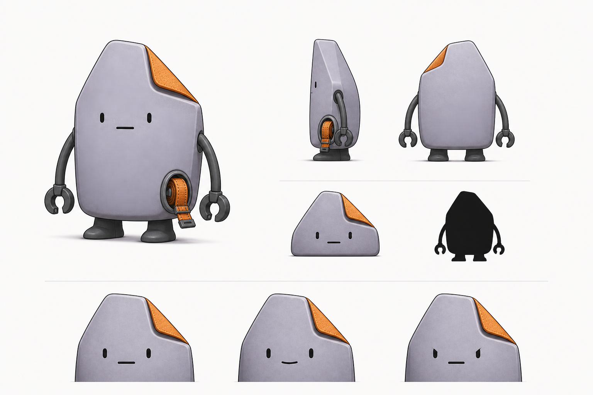
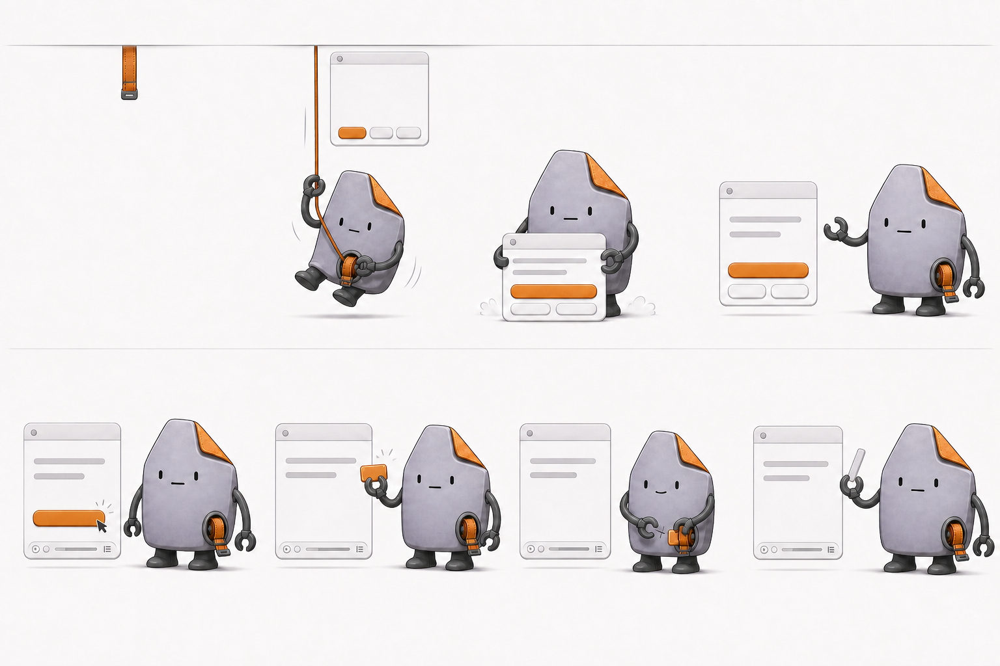
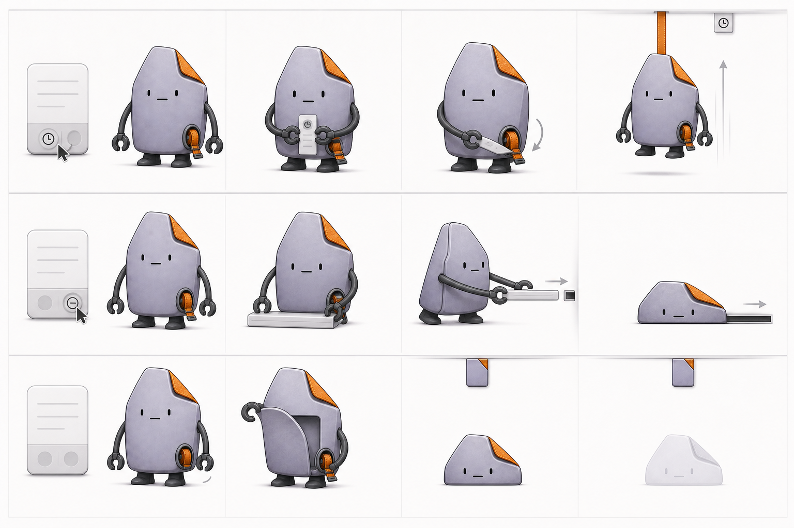
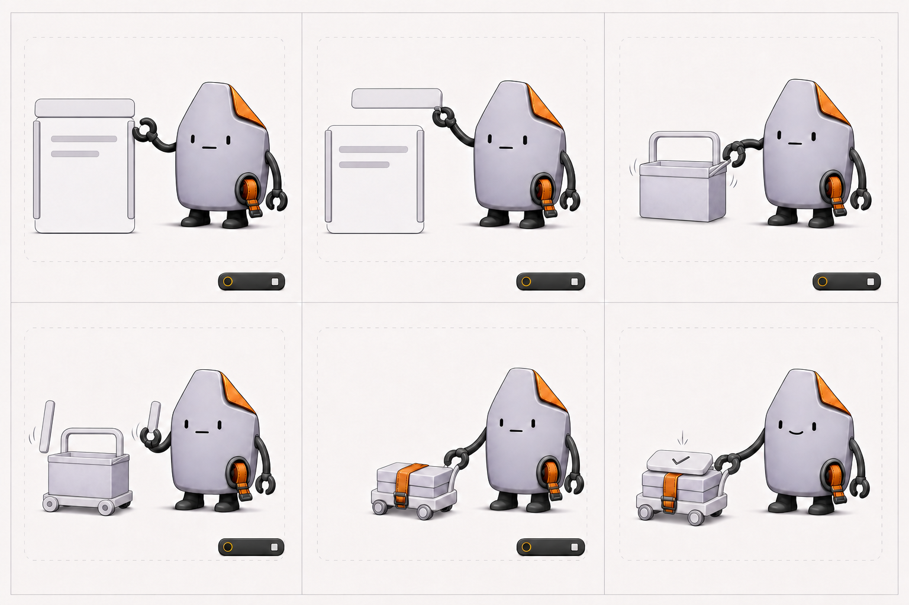
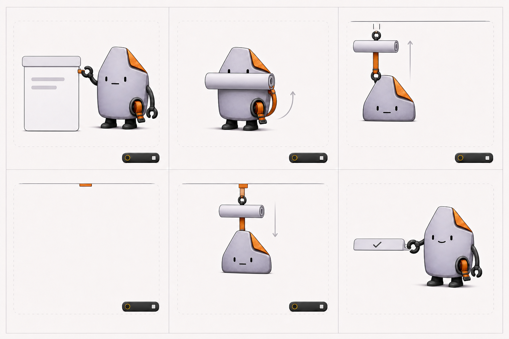
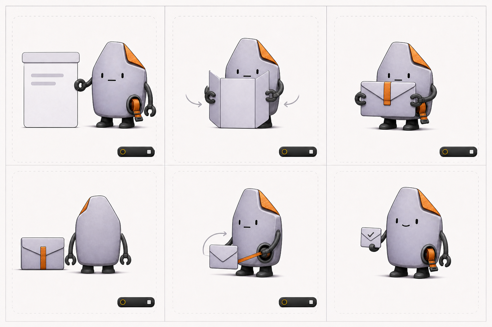
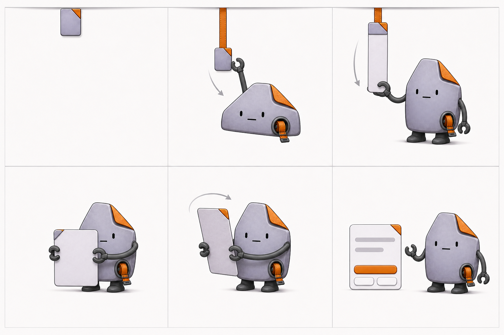
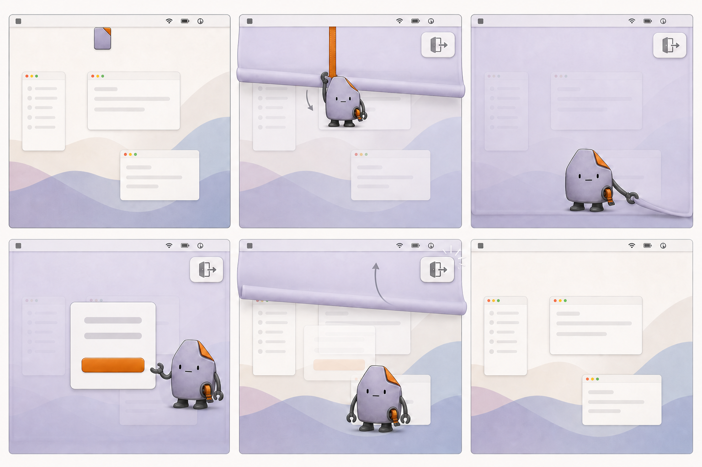

# HealthFirst 主角形象与动作语言

版本：0.7  
阶段：MVP 静态形象与完整提醒动作关键帧确认；登场、同意与站立黄金流程已接入正式运行资产

当前运行版已经接入平静、左右接牌、卷轴收牌、轻笑、三分之四转身、背面、半折叠与折叠，以及站立流程的检查、举起、搬运、扶车和扶车微笑姿势，并以原生 SwiftUI 绘制角色实际操作的 UI 道具。登场、点击开始与站立 60 秒是首批生产级动作纵切；其余分镜仍按本文逐条替换灰盒实现，不把“动作语义已接通”误写成“正式角色动作已全部完成”。

## 1. 角色定位

主角是一位一本正经的“界面整理员”。它不监督用户，也不靠撒娇、卖惨或夸张表情推动行动；它把提醒框当作一套可以折叠、收纳和拆装的工作材料，用认真处理小事的反差制造幽默。

关键词：`可靠`、`克制`、`有一点笨拙`、`做事很认真`。

## 2. 已锁定的形象锚点

- 浅薰衣草灰色、略带纸张与软质工业材料触感的非对称文件页身体。
- 右上角固定的橙色折角，是轮廓识别点，不能拆下或变成道具。
- 身体下方的橙色织带卷轴，是角色的核心工具，也负责把动作与菜单栏连接起来。
- 深灰软管手臂、C 形夹手和短而稳的工作靴，让拿、折、推、卷等动作一眼可读。
- 两枚短竖眼和一条短嘴构成全部常驻五官；不增加眉毛。
- 正面、侧面、背面和折叠后的低矮形态都必须保持同一轮廓规则。

上述锚点在动画、菜单栏缩略形象和后续皮肤中都不能随意漂移。

## 3. 表情系统

首版只使用两种正式表情：

| 表情 | 使用场景 | 规则 |
|---|---|---|
| 平静脸 | 等待、说明、稍后、跳过、无回应、工作中 | 短竖眼与水平短嘴；占绝大多数时间 |
| 轻微微笑 | 用户开始、正常完成 | 嘴角只轻微上扬，持续约 0.8–1.5 秒；眼睛仅略微放松 |

站立开始时保留完整的 0.8–1.5 秒轻笑。护眼与安静练习是注意力和隐私优先的例外：工作牌进入卷轴后只保留约 100–150 ms 可感知的短确认，随即折叠离场或转身，不为了凑足表情时长延迟约 1.1 秒清屏与约 0.82 秒背身。

“专注”不另画生气眉眼，改由身体朝向、夹手位置和工作姿势表达。禁止失望、委屈、愤怒、哭泣、叹气、凝视催促和夸张庆祝。

表情只确认系统收到了用户的选择，不承担劝服和施压。

## 4. 道具与动作语法

### 4.1 橙色织带

橙色织带负责表示路径和时间关系：

- 从菜单栏垂下：角色登场。
- 向上收回：稍后还会回来。
- 卷入卷轴：收到用户指令并开始工作。
- 作为捆扎带或推车把手：陪伴阶段收纳 UI 零件。

织带不承担警告含义，不闪烁，也不变成进度惩罚。

### 4.2 浅灰 UI 零件

角色只操作已点击后的按钮实体、已读正文和装饰边框。可点击控制、倒计时、`提前结束`和辅助功能焦点始终固定在安全操作层。

角色自身的橙色折角绝不脱落。被拆下的 UI 零件统一使用浅灰或浅薰衣草色，避免和角色身体混淆。

### 4.3 折叠形态

角色可以折成参考稿中的低矮楔形，用于快速归档和低注意力陪伴。折叠不是受伤、泄气或失败，而是它的正常工作形态。

## 5. 第一组正式动作

### 5.1 登场与同意

从左到右：

1. 橙色织带先从菜单栏垂下。
2. 角色顺着织带下降，同时提醒卡展开。
3. 角色落地并把提醒卡扶正。
4. 角色以平静脸呈现三个固定选项。
5. 用户点击开始后，主按钮立即确认。
6. 主按钮转成一枚小型工作牌，被角色接住；安全操作条固定在原位。
7. 角色把工作牌放入卷轴，短暂轻笑。
8. 角色恢复平静脸，拆下第一条浅灰装饰边，进入陪伴阶段。

角色动画不阻塞业务状态；点击开始后，计时与安全操作层应在 400 ms 内可用，角色可以在随后约 250 ms 内完成自己的收尾动作。

### 5.2 三种离场

三条动作依靠方向和轮廓区分：

- 稍后：提醒折成预约票并卷入橙色卷轴，角色沿织带向上返回菜单栏；顶部留下时钟标签。
- 本次跳过：提醒被压成横向归档条，角色折成低矮形态并向屏幕侧边滑走；不留下待处理标记。
- 无回应：角色安静收起内容并折叠，原地淡出；菜单栏只留下无时钟的待处理书签。

无回应分镜中的胸前开合结构暂定为“工具收纳口”。正式建模前需要再验证它是否过度强化电器感；若不合适，改为角色从身体侧后方取出一只浅灰收纳套，不改变其余动作节奏。

## 6. 动画尺度

- 大转场 280–420 ms，小动作 120–180 ms，笑点停顿 180–250 ms。
- 弹性最多回弹一次；不使用持续弹跳或高频循环。
- 平静待机最多使用一次 8–12 px 的轻微重心移动，周期不少于 4–6 秒。
- `Reduce Motion` 下，位移、折叠和缩放全部替换为原位交叉淡化与静态状态切换。
- 角色层不接收点击，并从辅助功能树隐藏；信息与操作不能只依赖角色动作表达。

## 7. 站立 60 秒：UI 小推车

六格从左到右、从上到下对应六个离散里程碑：

| 阶段 | UI 与角色动作 | 保持不变 |
|---|---|---|
| 0–8 秒 | 完整提醒保留；角色检查浅灰装饰轨，像准备做一项小工程 | 深灰安全功能坞固定 |
| 8–22 秒 | 标题条被取下，弯成小推车把手 | 倒计时与提前结束不动 |
| 22–38 秒 | 正文与背板折成浅灰货箱，放上车架 | 实际窗口边界不变 |
| 38–52 秒 | 两条装饰轨组成底盘，装饰端帽成为小轮 | 功能坞不参与组车 |
| 52–60 秒 | 橙色织带捆好零件；角色扶住车把，安静等待 | 不新增吸引视线的动作 |
| 完成 | 功能坞才收成唯一一块完成牌；角色放到车顶并轻微微笑 | 业务先写入 `completed` |

静态稿中的深灰功能坞是为了明确展示“不可拆的交互层”，不是最终 UI 配色决定；正式界面仍需结合浅色、深色、Increase Contrast 与 Reduce Transparency 分别校准。

小笑点放在完成瞬间：最后一块很轻的完成牌被一本正经地放上车后，车身只向下压 2–4 px，角色迅速扶稳。该动作只播放一次，不使用粒子或庆祝循环。

实现时不播放一条持续 60 秒的角色动画，只在固定里程碑触发 4 次短动作。虚线范围代表固定不变的 `NSPanel` 内容舞台；可拆的只是装饰与已读信息层。

## 8. 护眼 20 秒：把屏幕内容卷走

六格从左到右、从上到下对应：

| 阶段 | UI 与角色动作 | 注意力约束 |
|---|---|---|
| 0–200 ms | 角色把橙色织带夹到提醒卡上缘 | 安全功能坞固定 |
| 200–650 ms | 卷轴把提醒卡卷成横向软卷；软卷短暂遮住角色的嘴 | 只出现一次卷动 |
| 650–1100 ms | 软卷与折叠角色一起沿织带回到菜单栏 | 角色不挥手、不停留 |
| 1.1–20 秒 | 角色和卡片完全离场，只留静态小标签与安全功能坞 | 不显示数字，不播放中场动画 |
| 20 秒 | 完成后才把同一软卷和折叠角色放回 | 不在 18 秒提前吸引视线 |
| 20–20.6 秒 | 只展开一条窄完成牌；角色短暂轻笑 | 不重新展开完整提醒卡 |

第二格的笑点是角色在收起屏幕内容时，顺手把自己的嘴也挡住；它在动作逻辑上表达“这里已经没有需要你看的东西”。

分镜中的橙色进度环是静态状态标记，不应在 20 秒内持续旋转或逐秒刷新。默认不显示数字倒计时；鼠标悬停、键盘焦点或辅助功能查询时才提供剩余时间。应用不检测用户是否真的看向远处，也不会因为鼠标或视线变化重置计时。

`Reduce Motion` 下不播放卷起、升降和折叠：开始后在 200 ms 内交叉淡出角色与卡片，保留静态功能坞；完成时直接淡入窄完成牌和静态微笑姿势。

## 9. 安静练习 30 秒：中性隐私信封

六格从左到右、从上到下对应：

| 阶段 | UI 与角色动作 | 隐私边界 |
|---|---|---|
| 0–250 ms | 角色接住已经开始的无字提醒卡 | 安全功能坞固定 |
| 250–600 ms | 卡片翻到空白背面，左右向内折 | 具体练习内容立即不可见 |
| 600–900 ms | 卡片成为普通浅灰信封，橙色织带只做一次封口 | 不出现锁、爱心或身体图示 |
| 0.9–30 秒 | 角色完整转过身，像一本正经的隐私值班员 | 静止、不观察、不计次 |
| 30–30.4 秒 | 完成后角色才转回三分之四侧面，收回封口带 | 不提前制造结束暗示 |
| 30.4–31 秒 | 信封折成一块小完成牌；角色短暂轻笑 | 不重新展示原始内容 |

这里的笑点不是“秘密”或“害羞”，而是角色对隐私过于认真，干脆把整个身体转过去。背面姿势必须使用静态设定中的真实背面轮廓，不在背后添加眼睛、表情或正面的橙色卷轴。

30 秒只是本轮陪伴总时长，不代表盆底肌收缩节奏。界面不播放松紧、脉冲、呼吸或重复次数动画；角色不模仿动作，也不宣称看见、判断或验证了用户练习。

公开标题、菜单栏、屏幕共享与 VoiceOver 文案统一使用`安静练习`或`小动作`。具体说明只在用户主动打开的设置页出现。

`Reduce Motion` 下，内容卡直接交叉淡化为密封信封，角色的正面与背面使用静态姿势切换；完成时小完成牌原位淡入。

## 10. 第二次返回：展开书签的另一面

六格从左到右、从上到下对应：

| 阶段 | UI 与角色动作 | 语气边界 |
|---|---|---|
| 等待中 | 菜单栏下只留一枚无时钟的待处理书签 | 不闪烁、不显示未完成数量 |
| 0–180 ms | 橙色织带带着折叠角色返回，角色伸手取书签 | 与首次进入保持相同动静级别 |
| 180–360 ms | 书签向下展开成窄纸条，空白背面朝外 | 不显示旧文案 |
| 360–500 ms | 纸条展开成完整卡片，但仍是空白背面 | 角色只停半拍，不作惊讶表情 |
| 500–650 ms | 角色把卡片翻到另一面，露出新文案和固定按钮 | 不变红、不放大、不加警告 |
| 650 ms 后 | 角色恢复平静等待姿势 | 不循环催促或敲击屏幕 |

小笑点是角色认真展开后发现卡片朝反了，随后不动声色地翻面。它说明“这是上一次退场动作的后半段”，同时让第二次提醒拥有新动作，而不是复制首次入场。

第二次卡片与第一次使用相同尺寸、位置和三个按钮槽，只替换正文与可选的小道具。待处理书签不能带时钟：时钟只表示用户主动选择的稍后。

业务状态不等待翻面完成。卡片正面可用后，按钮最迟在 700 ms 内具备键盘与辅助功能操作；用户若在动画收尾期间选择操作，立即取消剩余动画并进入对应状态。

`Reduce Motion` 下，书签与正面卡片在原位交叉淡化，不播放下拉、展开或三维翻面。第二次仍无回应时，默认只回到菜单栏书签，不继续主动弹出；认真模式除外。

## 11. 认真模式：铺开柔和工作垫

六格从左到右、从上到下对应：

| 阶段 | UI 与角色动作 | 安全边界 |
|---|---|---|
| 进入前 | 普通桌面与菜单栏书签保持可见 | 仅用户预先开启此模式时继续 |
| 0–200 ms | 右上紧急退出先变为可操作；角色开始铺下柔和遮罩 | 退出控制位于最上层且不移动 |
| 200–350 ms | 遮罩覆盖当前屏幕；角色把巨大软垫边缘扶正 | 桌面仍可辨认，不模拟锁屏 |
| 350–500 ms | 中央出现正常尺寸提醒卡与一个主按钮 | 不放大角色，不增加警告色 |
| 紧急退出 0–200 ms | 先撤遮罩并恢复桌面可读性 | 状态立即写为 `emergencySkip` |
| 200 ms 后 | 再清理角色、卡片和装饰 | 动画失败也不能延迟退出 |

笑点来自小角色认真处理一张远大于自己的“工作垫”，而不是角色变得严厉。遮罩是均匀、低对比度的浅薰衣草灰，不改变显示器亮度，不闪烁，也不依赖强模糊才能读清界面。

右上`紧急跳过`从第一帧遮罩出现前就可操作，并保持同一位置、尺寸和标签；Esc 与它执行同一状态迁移。不能要求长按、二次确认或解释理由。

用户选择开始后，先写入 `guided`，随后撤掉认真模式的大遮罩与中央卡片，再交给对应的护眼、站立或安静练习陪伴流程。认真模式只负责获得明确回应，不覆盖整个 20/30/60 秒引导。

`Reduce Motion` 下，遮罩与中央卡片只做原位交叉淡化，不播放铺垫或卷起。`Reduce Transparency` 下改用不透明系统背景色与清楚边界。多显示器时只有当前交互屏幕包含可点击、可朗读的卡片与退出按钮；其他遮罩层若启用，必须禁止点击并从辅助功能树隐藏。

## 12. 下一阶段

角色动作概念已经覆盖首次进入、开始、稍后、跳过、无回应、再次返回、三类陪伴、完成与认真模式。固定窗口层级、状态机、无角色降级、正式登场/同意和站立 60 秒黄金流程均已落地。下一阶段不再堆概念稿：优先把三种离场与二次返回做成正式角色动作，再补齐护眼、安静练习和认真模式中的角色协作，最后统一打磨卡片材质与深浅色细节。
